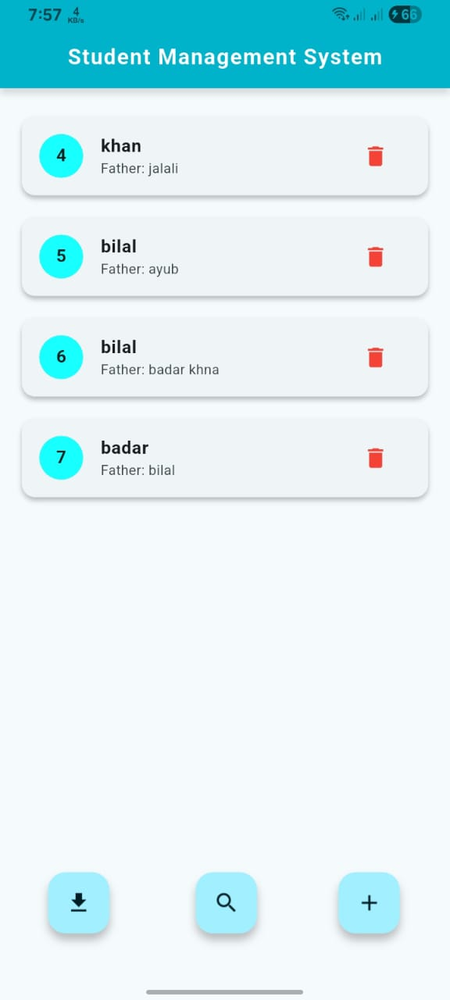
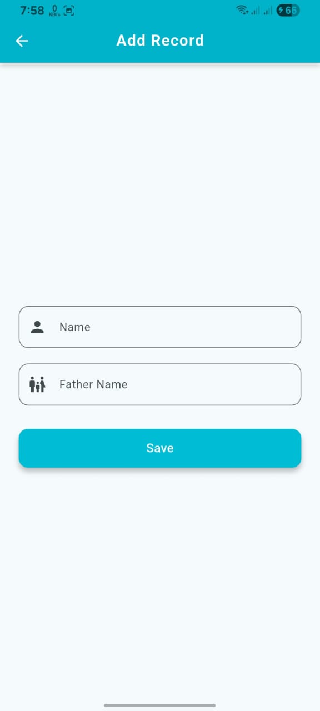
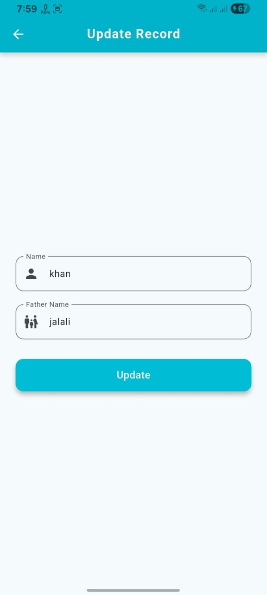

# Flutter Student Management App

A Flutter application built to manage student records locally using SQLite.
It implements full CRUD operations and focuses on clean UI, local data handling,
and advanced search logic.

### Features
- Add, update, and delete student records
- Local data persistence using SQLite
- Live search with multiple filters (ID, name, father name)
- Clean and responsive UI

### Tech Stack
- Flutter
- Dart
- SQLite (sqflite)

### Screenshots

| Dashboard | Add Record | Update Record | Search |
|-----------|------------|---------------|--------|
|  |  |  |  |

### How to Run
1. Clone the repository
2. Run `flutter pub get`
3. Run `flutter run`
